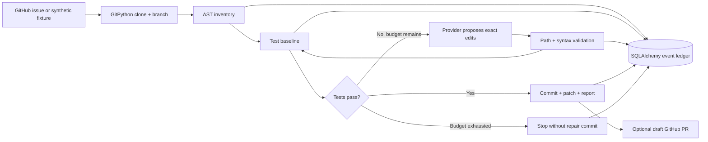

# RepoForge

**An issue-to-patch agent that makes its repair loop inspectable.**

[](https://github.com/dileepreddy27/repoforge-agent/actions/workflows/ci.yml)

Automated code changes are easy to generate and difficult to trust. RepoForge connects a Git branch, static Python analysis, bounded repair attempts, isolated test execution, and an event ledger. It produces a patch and review notes only after the existing test suite passes. Live publishing is an explicit option and creates a **draft** pull request.

This is a portfolio engineering prototype, not an unrestricted autonomous maintainer. The reproducible demo uses a **scripted repair provider and synthetic repository**. It requires no model account, GPU, paid service, or Docker engine.

## Try the repair loop

Requirements: Python 3.11+, Git. Run from a fresh clone:

```bash
python -m venv .venv
# macOS/Linux
source .venv/bin/activate
# Windows PowerShell: .venv\Scripts\Activate.ps1
python -m pip install -e '.[dev]'
repoforge demo --output work/demo
```

Open `work/demo/report.html` to inspect the run. The same directory contains `report.json`, `patch.diff`, `pull-request.md`, a Git checkout, and a separate execution copy. Choose a new output directory for each run; earlier evidence is never overwritten.

The fixture's `mean()` function incorrectly rounds fractional means and accepts an empty sample:

| Stage | Expected demonstration |
| --- | --- |
| Baseline | Three failures across four tests |
| Repair 1 | Empty input fixed; fractional and negative means still fail |
| Repair 2 | Four tests pass; a source-only commit becomes ready for review |

The demo proves workflow mechanics, **not LLM repair accuracy**. Download and open the [recorded HTML demo](docs/demo-report.html), or regenerate it with the command above. See [verification evidence](docs/verification.md) for observed results and integration limits.

## Architecture



LangGraph owns the state transitions. The repair edge is deliberately cyclic, with a maximum of five attempts; describing the entire workflow as a DAG would be inaccurate. AST analysis inventories functions and imports without executing repository code; it is not a whole-program dependency resolver.

| Component | Actual implementation |
| --- | --- |
| Orchestration | Python, LangGraph typed state and conditional routing |
| Repository handling | GitPython clone, dedicated branch, source commit and diff |
| Code context | Python `ast`, bounded source context, exact-match edit validation |
| Execution | Fixed `unittest` command in Docker; trusted local fixture fallback |
| State | SQLAlchemy JSON events; SQLite by default, PostgreSQL via psycopg |
| Model | Optional OpenAI JSON adapter; scripted demo provider |
| Review | Escaped standalone HTML, JSON ledger export, Markdown PR body |
| Delivery | GitHub CLI issue lookup, explicit branch push and draft PR creation |

## Docker and PostgreSQL

Docker must be running. The runner never installs repository dependencies or enables container networking. This version supports standard-library Python projects laid out as `src/` and `tests/`.

```bash
docker pull python:3.11-slim
repoforge demo --docker --output work/docker-demo
```

Containers run without network access, as a non-root user, with a read-only repository/root filesystem, dropped capabilities, no-new-privileges, CPU/memory/PID limits, a small temporary filesystem, and a wall-clock timeout. Git metadata is excluded from the execution copy.

To use PostgreSQL, set `POSTGRES_PASSWORD` in your local environment, run `docker compose up -d`, and set `REPOFORGE_DATABASE_URL` to a SQLAlchemy URL such as `postgresql+psycopg://repoforge:<password>@localhost:5432/repoforge`. Do not commit credentials. SQLite is sufficient for the demo. Event persistence is an audit trail; crash recovery/resumption is not implemented.

## Live issue adapter

Prerequisites: an authenticated `gh`, a public GitHub repository you are allowed to modify, Docker, and a user-configured `OPENAI_API_KEY`. The selected model must support Chat Completions JSON mode. Live model calls incur provider usage charges; none are needed for the demo.

```bash
repoforge issue OWNER/REPOSITORY 123 --model MODEL_NAME --output work/issue-123
# Only after deciding to publish a draft PR:
repoforge issue OWNER/REPOSITORY 123 --model MODEL_NAME --output work/issue-123-publish --publish
```

Without `--publish`, the adapter produces a local branch and review artifacts. Publishing requires push access to the same repository; automated fork creation is not implemented. The second command starts a new run, rather than approving the first run's exact patch. Inspect any resulting draft PR before merging.

The adapter transmits the issue, source context, and test output to the model provider. Use only repositories whose content you are authorized to send. No live-model effectiveness or third-party PR creation is claimed by this demo.

## Verify

```bash
python -m ruff check .
python -m pytest -q
```

Integration tests run when `REPOFORGE_TEST_DOCKER=1` and/or `REPOFORGE_TEST_POSTGRES` is set to a test database URL. GitHub Actions provisions both Docker and PostgreSQL, runs the full suite, and uploads synthetic demo artifacts. Tests cover the successful repair loop, exhaustion, invalid edits, unchanged fixture source, AST non-execution, path traversal, syntax rejection, empty test discovery, timeout handling, and event storage.

## Deliberate limits

- Edits are restricted to existing `src/**/*.py`; no test edits, dependency updates, file creation, or arbitrary test commands.
- Existing tests are the oracle. Passing them does not prove the issue is solved, prevent malicious source behavior, or guarantee correctness beyond coverage.
- Docker shares the host kernel and is not a hostile multi-tenant sandbox. Use disposable hosts for untrusted repositories. Clone/AST parsing also run on the host.
- The local runner is for the bundled trusted fixture only; the live CLI always selects Docker.
- Import lists do not resolve dynamic imports or construct a complete dependency graph.
- Retry budget and test runtime are bounded; clone size, disk output, and model token cost do not yet have complete quotas. Test logs are truncated in reports, not on disk.
- No automatic merge, deployment, self-modification, checkpoint replay, or production reliability claims.

See [security boundaries](docs/security.md) and [engineering decisions](docs/decisions.md).

## Roadmap

1. Structured test-result channel and stronger output/clone quotas.
2. Checkpoint recovery and idempotent publishing of an already-reviewed patch.
3. Dependency-aware context selection and isolated language-specific images.
4. A licensed, held-out issue benchmark with measured repair rates and costs.

## Resume-ready summary

- Built a Python/LangGraph issue-to-patch workflow with AST context, bounded repair routing, Git branch isolation, and an inspectable event ledger.
- Implemented source-only edit validation and a restricted Docker test runner; exercised a synthetic two-attempt repair flow without paid model services.

MIT licensed. All bundled fixture code is original synthetic demonstration material.
